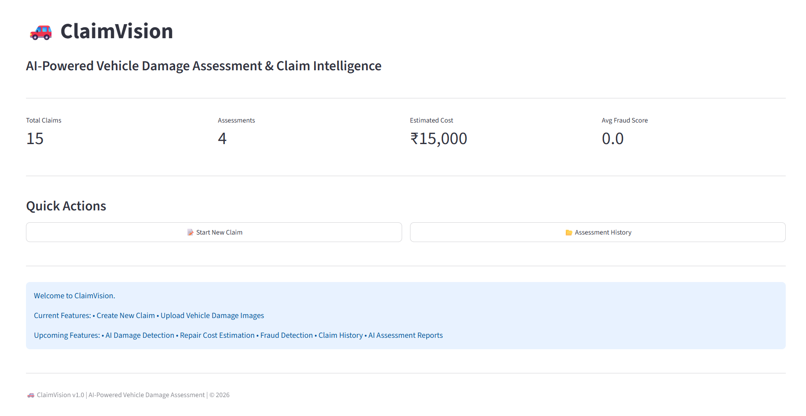
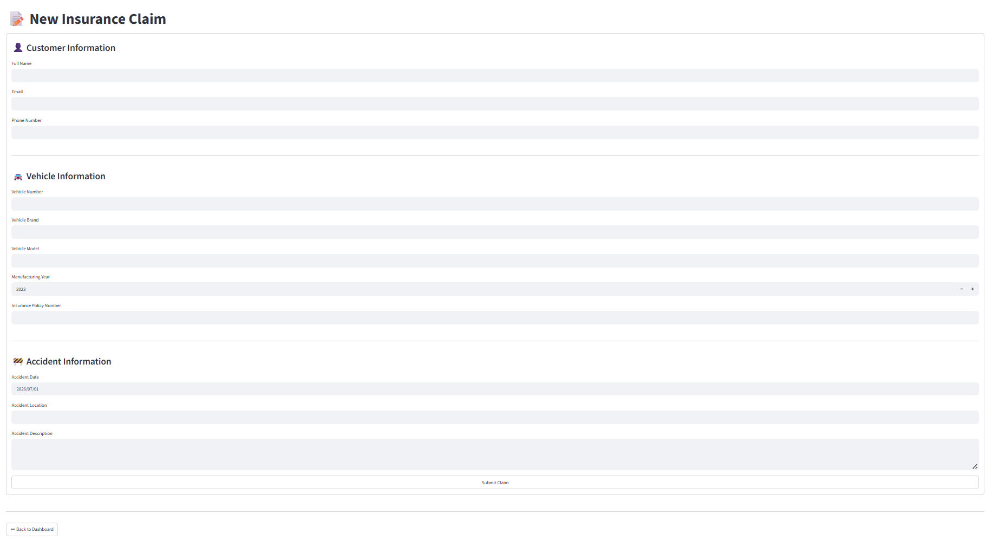
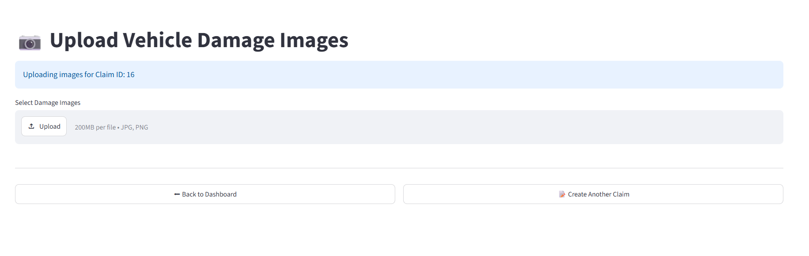
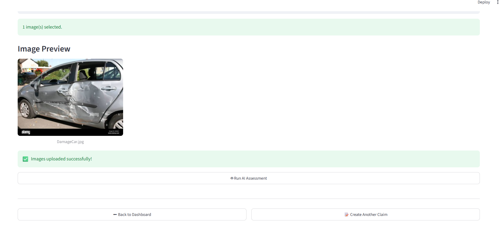
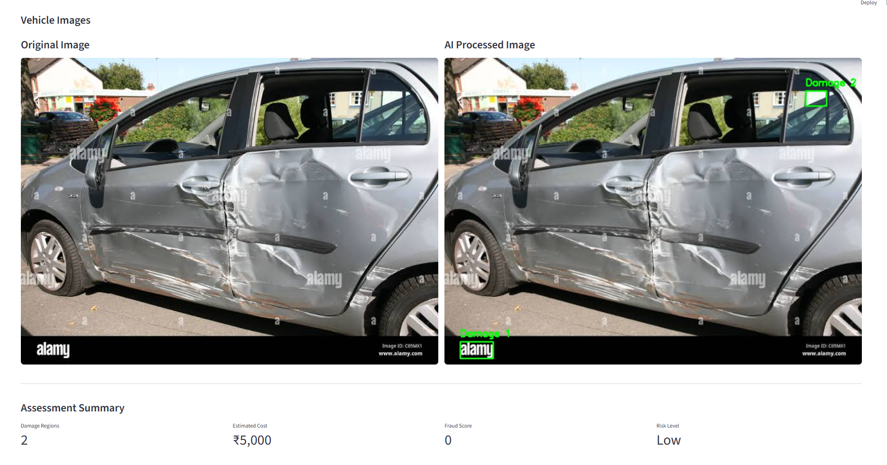
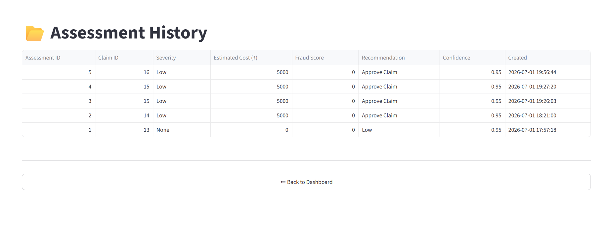
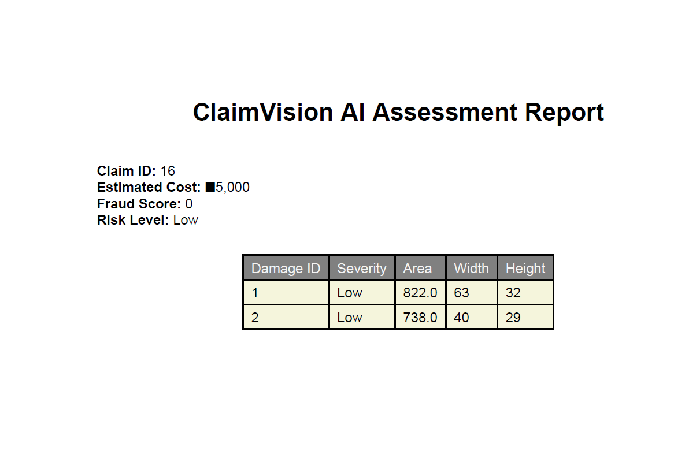

# 🚗 ClaimVision

## AI-Powered Vehicle Damage Assessment & Claim Intelligence

ClaimVision is an enterprise-style AI-powered application developed to automate vehicle damage assessment for insurance claims. The system leverages computer vision techniques to analyze uploaded vehicle images, estimate repair costs, perform fraud analysis, and generate AI-driven assessment reports.

The application follows a layered architecture with separate UI, Service, Repository, ORM, and Database layers, making it scalable, maintainable, and easy to extend.

---

## ✨ Features

### Claim Management
- Customer Registration
- Vehicle Registration
- Insurance Claim Creation

### Image Processing
- Upload Vehicle Damage Images
- Image Preprocessing using OpenCV
- Image Validation

### AI Assessment
- Damage Detection
- Severity Classification
- Repair Cost Estimation
- Fraud Risk Analysis
- AI Recommendation Engine

### Reporting
- Assessment Dashboard
- Assessment History
- PDF Assessment Report

### Database
- SQL Server Integration
- SQLAlchemy ORM
- Repository Pattern

---

## 🛠 Technology Stack

| Technology | Purpose |
|------------|---------|
| Python 3.13 | Backend |
| Streamlit | User Interface |
| SQL Server 2022 Express | Database |
| SQLAlchemy | ORM |
| PyODBC | SQL Connectivity |
| OpenCV | Image Processing |
| NumPy | Numerical Operations |
| Pandas | Data Analysis |
| Pillow | Image Handling |
| ReportLab | PDF Report Generation |

---

## 🏗 Architecture

```text
Presentation Layer (Streamlit)
            │
            ▼
      Service Layer
            │
            ▼
     Repository Layer
            │
            ▼
      SQLAlchemy ORM
            │
            ▼
      SQL Server

            │
            ▼

      AI Processing Layer

ImageProcessor
      │
DamageDetector
      │
CostEstimator
      │
FraudDetector
      │
AssessmentService
```

---

## 🤖 AI Workflow

```text
Customer
      │
Vehicle
      │
Claim
      │
Upload Vehicle Image
      │
Image Preprocessing
      │
Damage Detection
      │
Cost Estimation
      │
Fraud Analysis
      │
AI Assessment Dashboard
      │
Save Assessment
      │
Assessment History
      │
Generate PDF Report
```

---

## 📂 Project Structure

```text
ClaimVision/

├── ai/
│   ├── image_processor.py
│   ├── damage_detector.py
│   ├── cost_estimator.py
│   └── fraud_detector.py
│
├── database/
│   ├── models.py
│   └── repository.py
│
├── services/
│
├── ui/
│
├── tests/
│
├── uploads/
│
├── app.py
├── requirements.txt
└── README.md
```

---

## 🗄 Database Tables

- Customers
- Vehicles
- Claims
- UploadedImages
- DamageAssessment

---

## 📸 Application Screenshots

### Dashboard



---

### Create Claim



---

### Upload Vehicle Images

*

---

### AI Assessment




---

### Assessment History



---

### PDF Assessment Report


---

## ⚙ Installation

Clone the repository

```bash
git clone https://github.com/<your-username>/ClaimVision.git
```

Create a virtual environment

```bash
python -m venv .venv
```

Activate the virtual environment

```bash
.\.venv\Scripts\activate
```

Install dependencies

```bash
pip install -r requirements.txt
```

Run the application

```bash
streamlit run app.py
```

---

## 🚀 Future Enhancements

- Deep Learning Damage Detection (YOLO)
- Batch Image Assessment
- Authentication & Authorization
- Cloud Deployment
- REST API
- Email Notifications

---

## 👩‍💻 Author

**Jyotsna Gupta**

ClaimVision – AI-Powered Vehicle Damage Assessment & Claim Intelligence

Developed as an enterprise-style AI application using Python, Streamlit, SQL Server, SQLAlchemy, and OpenCV.